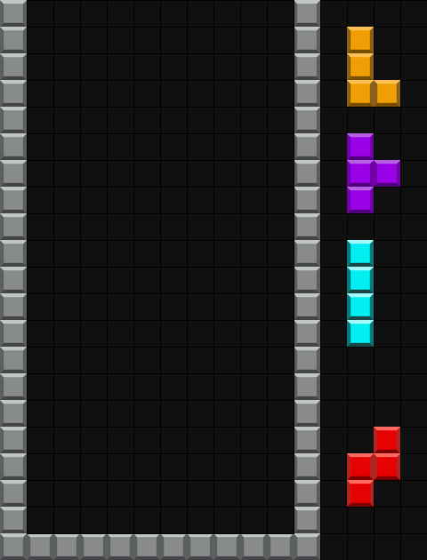

# tetris-gif-generator

This is a tool for creating GIFs from Tetris board data.

<p align="center">
  
</p>

## Setup

```bash
rye sync
```

## Run

To generate the GIFs, run the following command:

```bash
rye run generate
```

## Input

The input format consists of the following parameters:

- T: Number of turns
- W: Width of the Tetris board
- H: Height of the Tetris board
- f: Tetris board data
- next: Next minos data
- hold: Hold minos data

Followed by the Tetris board data in the format:

$$
T\ H\ W
$$

$$
\begin{bmatrix}
    f_{1,1,1} & f_{1,2,1} & \cdots & f_{1,W,1} \\
    f_{2,1,1} & f_{2,2,1} & \cdots & f_{2,W,1} \\
    \vdots & \vdots & \ddots & \vdots \\
    f_{H,1,1} & f_{H,2,1} & \cdots & f_{H,W,1} \\
\end{bmatrix}
$$

$$
next_{1,1},\ next_{2,1},\ \cdots
$$

$$
hold_{1} \\
$$

$$
\vdots \\
$$

$$
\begin{bmatrix}
    f_{1,1,T} & f_{1,2,T} & \cdots & f_{1,W,T} \\
    f_{2,1,T} & f_{2,2,T} & \cdots & f_{2,W,T} \\
    \vdots & \vdots & \ddots & \vdots \\
    f_{H,1,T} & f_{H,2,T} & \cdots & f_{H,W,T} \\
\end{bmatrix} \\
$$

$$
next_{1,T},\ next_{2,T},\ \cdots \ , \\
$$

$$
hold_{T} \\
$$

The table below shows the correspondence between the numbers and Tetris pieces along with their respective colors:

<div align="center">

| Number | Tetris Piece | Color  |
| :----: | :----------: | :----: |
|   0    |    Empty     | Black  |
|   1    |   I Minos    |  Cyan  |
|   2    |   J Minos    |  Blue  |
|   3    |   L Minos    | Orange |
|   4    |   O Minos    | Yellow |
|   5    |   S Minos    | Green  |
|   6    |   T Minos    | Purple |
|   7    |   Z Minos    |  Red   |
|   8    |     Wall     | White  |

</div>
